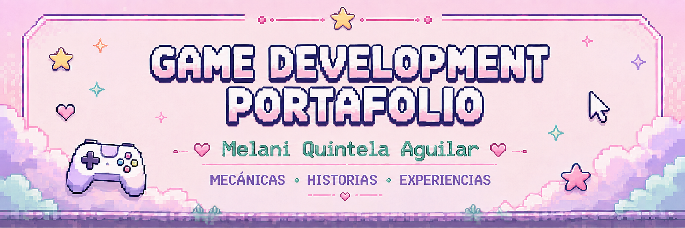
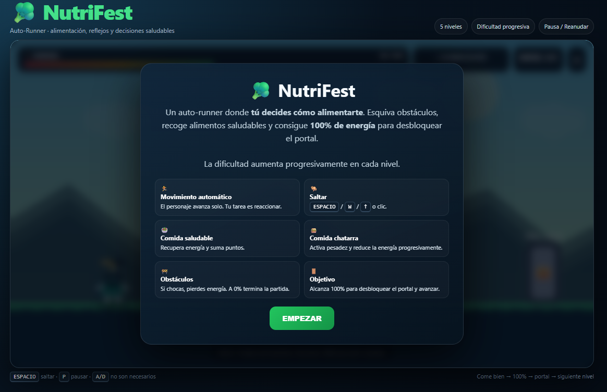
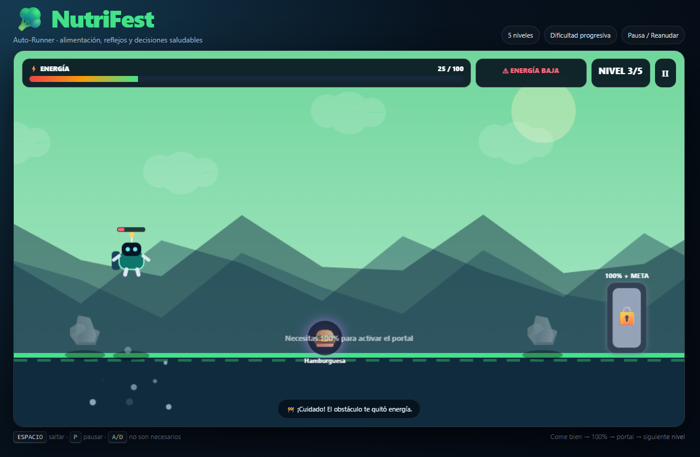
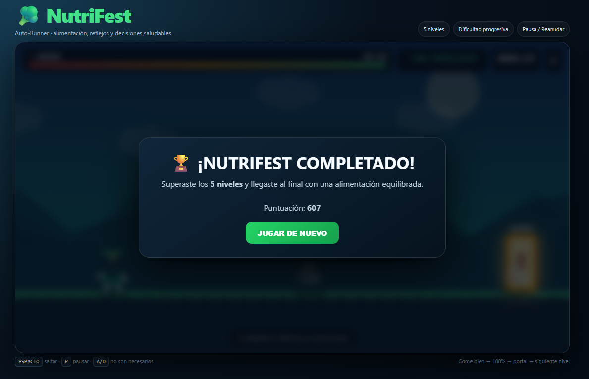
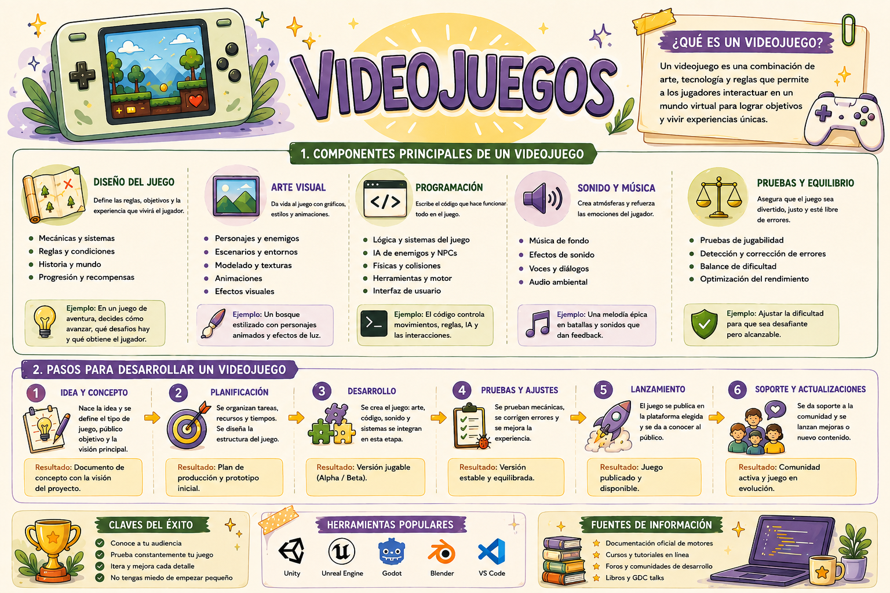

  

  <a href="#sobre">🌟 Sobre mí</a>
  &nbsp; • &nbsp;
  <a href="#juegos">🎮 Juegos</a>
  &nbsp; • &nbsp;
  <a href="#tecnologias">🛠️ Herramientas</a>
  &nbsp; • &nbsp;
  <a href="#ia">🤖 IA</a>
  &nbsp; • &nbsp;
  <a href="#progreso">🎯 Progreso</a>

---

## 🌟 Sobre este portafolio

Bienvenido a mi portafolio de **Game Development**, un espacio donde reúno los videojuegos y prototipos que he desarrollado mientras exploro distintas áreas del diseño de videojuegos.

Lo que más me interesa de Game Development es la posibilidad de transformar una idea en una experiencia interactiva: **diseñar mecánicas, construir historias y pensar en cómo el jugador experimenta cada decisión dentro del juego**.

Actualmente continúo aprendiendo y experimentando con diferentes conceptos de desarrollo, combinando creatividad, programación y diseño para construir proyectos funcionales y cada vez más completos.

---
<h2 align="center">🎮 SELECCIONA UN JUEGO</h2>

  <i>Explora los seis prototipos desarrollados durante mi proceso de aprendizaje.</i>

<table align="center">
<tr>

<td align="center" width="33%">

 
<b>🎮 EduMundo</b>
 
Plataformas · Matemáticas
</td>

<td align="center" width="33%">

 
<b>♻️ EcoFest</b>
 
Reciclaje · Arcade
</td>

<td align="center" width="33%">

 
<b>🍎 NutriFest</b>
 
Runner · Alimentación
</td>

</tr>

<tr>

<td align="center" width="33%">

 
<b>💧 WaterFest</b>
 
Minijuegos · Ahorro de agua
</td>

<td align="center" width="33%">

 
<b>💬 Bully</b>
 
Narrativa · Storytelling
</td>

<td align="center" width="33%">

 
<b>💰 MyEconomy</b>
 
Simulación · Finanzas
</td>

</tr>
</table>

 

<h3 align="center">🗺️ MI RUTA DE APRENDIZAJE</h3>

  Cada prototipo representa una etapa diferente de mi proceso en Game Development.

  <kbd>01 · Fundamentos</kbd>
  &nbsp; ➜ &nbsp;
  <kbd>02 · Proceso</kbd>
  &nbsp; ➜ &nbsp;
  <kbd>03 · Mecánicas</kbd>

  ↓

  <kbd>04 · Player Persona</kbd>
  &nbsp; ➜ &nbsp;
  <kbd>05 · Storytelling</kbd>
  &nbsp; ➜ &nbsp;
  <kbd>06 · GDD</kbd>

 

---

## 🕹️ Mis videojuegos

Cada proyecto explora un aspecto diferente del diseño y desarrollo de videojuegos, desde mecánicas educativas hasta narrativa, diseño centrado en el jugador y toma de decisiones.

  LEVEL 01 · FUNDAMENTOS

<h2 align="center">🎮 EduMundo</h2>

  <code>PLATAFORMAS 2D</code>
  &nbsp; ✦ &nbsp;
  <code>EDUCATIVO</code>
  &nbsp; ✦ &nbsp;
  <code>MATEMÁTICAS</code>

  

**EduMundo** es un videojuego educativo de plataformas 2D en el que el jugador debe avanzar mientras resuelve operaciones matemáticas. Cada pregunta presenta cuatro posibles respuestas integradas directamente en los bloques del escenario, convirtiendo la resolución de ejercicios en parte de la mecánica de juego.

  🌐 <b>HTML · CSS · JavaScript</b>
  &nbsp;&nbsp;•&nbsp;&nbsp;
  🎯 <b>10 desafíos matemáticos</b>
  &nbsp;&nbsp;•&nbsp;&nbsp;
  👤 <b>1.º de secundaria</b>

<b>🎮 Ver detalles del juego</b>

 

| 🎯 Característica | 📌 Información |
|---|---|
| **Género** | Plataformas 2D · Educativo |
| **Objetivo** | Completar 10 operaciones aritméticas y obtener la mayor puntuación posible |
| **Mecánica principal** | Moverse y saltar para golpear el bloque que contiene la respuesta correcta |
| **Tecnologías** | HTML · CSS · JavaScript |
| **Público objetivo** | Estudiantes de 1.º de secundaria |

  
  

  <a href="https://melaniquintelaaguilar.github.io/game-development-portfolio/juegos/01-edumundo/">
    <kbd>🎮 JUGAR</kbd>
  </a>
  &nbsp;
  <a href="https://github.com/MelaniQuintelaAguilar/game-development-portfolio/tree/main/juegos/01-edumundo">
    <kbd>📂 PROYECTO</kbd>
  </a>
  &nbsp;
  <a href="https://github.com/MelaniQuintelaAguilar/game-development-portfolio/blob/main/juegos/01-edumundo/README.md">
  <kbd>📖 DOCUMENTACIÓN</kbd>
  </a>

  LEVEL 02 · PROCESO DE DESARROLLO

<h2 align="center">♻️ EcoFest</h2>

  <code>CASUAL</code>
  &nbsp; ✦ &nbsp;
  <code>RECICLAJE</code>
  &nbsp; ✦ &nbsp;
  <code>SCORE</code>

  

**EcoFest** es un videojuego casual educativo enfocado en el reciclaje. El jugador debe identificar rápidamente cada residuo y atraparlo con el basurero correspondiente, reforzando la clasificación correcta de los desechos mediante repetición y toma de decisiones rápidas.

  🌐 <b>HTML · CSS · JavaScript</b>
  &nbsp;&nbsp;•&nbsp;&nbsp;
  ♻️ <b>Clasificación de residuos</b>
  &nbsp;&nbsp;•&nbsp;&nbsp;
  ❤️ <b>3 errores permitidos</b>

<b>🎮 Ver detalles del juego</b>

 

| 🎯 Característica | 📌 Información |
|---|---|
| **Género** | Casual · Educativo |
| **Objetivo** | Conseguir la mayor puntuación posible clasificando correctamente los residuos |
| **Mecánica principal** | Mover los basureros horizontalmente para atrapar cada residuo en el contenedor correcto |
| **Tecnologías** | HTML · CSS · JavaScript |
| **Dificultad** | La velocidad de caída aumenta conforme crece la puntuación |
| **Derrota** | Cometer 3 errores |
| **Público objetivo** | Jugadores de 6 años en adelante |

  
  &nbsp;&nbsp;&nbsp;
  

  <a href="https://melaniquintelaaguilar.github.io/game-development-portfolio/juegos/02-ecofest/">
    <kbd>🎮 JUGAR</kbd>
  </a>
  &nbsp;
  <a href="https://github.com/MelaniQuintelaAguilar/game-development-portfolio/tree/main/juegos/02-ecofest">
    <kbd>📂 PROYECTO</kbd>
  </a>
  &nbsp;
  <a href="https://github.com/MelaniQuintelaAguilar/game-development-portfolio/blob/main/juegos/02-ecofest/README.md">
    <kbd>📖 DOCUMENTACIÓN</kbd>
  </a>

  <a href="juegos/02-ecofest/">📂 Ver proyecto</a>

  LEVEL 03 · MECÁNICAS

<h2 align="center">🍎 NutriFest</h2>

  <code>RUNNER</code>
  &nbsp; ✦ &nbsp;
  <code>ALIMENTACIÓN</code>
  &nbsp; ✦ &nbsp;
  <code>DECISIONES</code>

  

**NutriFest** es un videojuego educativo de tipo runner enfocado en la alimentación saludable. Durante el recorrido, el jugador debe recoger alimentos mientras supera diferentes obstáculos, tomando decisiones que afectan directamente el movimiento y desempeño del personaje.

  🌐 <b>HTML · CSS · JavaScript</b>
  &nbsp;&nbsp;•&nbsp;&nbsp;
  🏃 <b>Runner</b>
  &nbsp;&nbsp;•&nbsp;&nbsp;
  🍎 <b>Alimentación saludable</b>

<b>🎮 Ver detalles del juego</b>

 

| 🎯 Característica | 📌 Información |
|---|---|
| **Género** | Runner · Educativo |
| **Objetivo** | Llegar al final del recorrido superando los obstáculos |
| **Mecánica principal** | Mover al personaje para recoger alimentos durante el recorrido |
| **Tecnologías** | HTML · CSS · JavaScript |
| **Alimentos saludables** | Mantienen la velocidad y agilidad del personaje |
| **Comida chatarra** | Reduce la velocidad del personaje y dificulta el avance |
| **Experiencia buscada** | Velocidad, tensión y satisfacción al tomar buenas decisiones |

  
  

  <a href="https://melaniquintelaaguilar.github.io/game-development-portfolio/juegos/03-nutrifest/">
    <kbd>🎮 JUGAR</kbd>
  </a>
  &nbsp;
  <a href="https://github.com/MelaniQuintelaAguilar/game-development-portfolio/tree/main/juegos/03-nutrifest">
    <kbd>📂 PROYECTO</kbd>
  </a>
  &nbsp;
  <a href="https://github.com/MelaniQuintelaAguilar/game-development-portfolio/blob/main/juegos/03-nutrifest/README.md">
    <kbd>📖 DOCUMENTACIÓN</kbd>
  </a>

  <a href="juegos/03-nutrifest/">📂 Ver proyecto</a>

  LEVEL 04 · PLAYER PERSONA

<h2 align="center">💧 WaterFest</h2>

  <code>MINIJUEGOS</code>
  &nbsp; ✦ &nbsp;
  <code>PLAYER PERSONA</code>
  &nbsp; ✦ &nbsp;
  <code>AHORRO DE AGUA</code>

  

**WaterFest** es un videojuego educativo centrado en el uso responsable del agua. A través de diferentes desafíos y minijuegos, el jugador debe tomar decisiones que permitan reducir el desperdicio de agua y conseguir la mayor puntuación posible.

  🌐 <b>HTML · CSS · JavaScript</b>
  &nbsp;&nbsp;•&nbsp;&nbsp;
  💧 <b>Ahorro de agua</b>
  &nbsp;&nbsp;•&nbsp;&nbsp;
  👤 <b>Diseño centrado en el jugador</b>

<b>🎮 Ver detalles del juego</b>

 

| 🎯 Característica | 📌 Información |
|---|---|
| **Enfoque** | Minijuegos · Educativo |
| **Objetivo** | Ahorrar la mayor cantidad de agua posible mientras se completan los desafíos |
| **Mecánica principal** | Resolver desafíos relacionados con hábitos de ahorro de agua |
| **Tecnologías** | HTML · CSS · JavaScript |
| **Sistema de puntuación** | Las buenas decisiones permiten conservar agua y obtener puntos |
| **Derrota** | Desperdiciar demasiada agua, exceder el tiempo o no completar los desafíos |
| **Diseño centrado en** | Player Persona de jóvenes de 18 a 25 años |

  
  

  <a href="https://melaniquintelaaguilar.github.io/game-development-portfolio/juegos/04-waterfest/">
    <kbd>🎮 JUGAR</kbd>
  </a>
  &nbsp;
  <a href="https://github.com/MelaniQuintelaAguilar/game-development-portfolio/tree/main/juegos/04-waterfest">
    <kbd>📂 PROYECTO</kbd>
  </a>
  &nbsp;
  <a href="https://github.com/MelaniQuintelaAguilar/game-development-portfolio/blob/main/juegos/04-waterfest/README.md">
    <kbd>📖 DOCUMENTACIÓN</kbd>
  </a>

  LEVEL 05 · STORYTELLING

<h2 align="center">💬 Bully</h2>

  <code>NARRATIVO</code>
  &nbsp; ✦ &nbsp;
  <code>STORYTELLING</code>
  &nbsp; ✦ &nbsp;
  <code>DECISIONES</code>

  

**Bully** es un prototipo narrativo centrado en las consecuencias del ciberbullying. A través de las decisiones del jugador, la historia muestra cómo las acciones del personaje afectan a otras personas y cómo sus elecciones pueden conducirlo hacia diferentes caminos.

  🌐 <b>HTML · CSS · JavaScript</b>
  &nbsp;&nbsp;•&nbsp;&nbsp;
  📖 <b>Narrativa emergente</b>
  &nbsp;&nbsp;•&nbsp;&nbsp;
  🔀 <b>Decisiones y consecuencias</b>

<b>🎮 Ver detalles del juego</b>

 

| 🎯 Característica | 📌 Información |
|---|---|
| **Enfoque** | Narrativo · Storytelling |
| **Estructura narrativa** | Narrativa emergente |
| **Objetivo narrativo** | Comprender el impacto de las acciones del personaje y sus consecuencias |
| **Mecánica principal** | Tomar decisiones que influyen en el desarrollo de la historia |
| **Tecnologías** | HTML · CSS · JavaScript |
| **Arco del personaje** | El protagonista puede continuar con su comportamiento o iniciar un proceso de cambio |
| **Recurso narrativo** | *Show, don't tell*: transmitir el mensaje mediante situaciones y consecuencias |

  
  

  <a href="https://melaniquintelaaguilar.github.io/game-development-portfolio/juegos/05-bully/">
    <kbd>🎮 JUGAR</kbd>
  </a>
  &nbsp;
  <a href="https://github.com/MelaniQuintelaAguilar/game-development-portfolio/tree/main/juegos/05-bully">
    <kbd>📂 PROYECTO</kbd>
  </a>
  &nbsp;
  <a href="https://github.com/MelaniQuintelaAguilar/game-development-portfolio/blob/main/juegos/05-bully/README.md">
    <kbd>📖 DOCUMENTACIÓN</kbd>
  </a>

  LEVEL 06 · GDD

<h2 align="center">💰 MyEconomy</h2>

  <code>SIMULACIÓN</code>
  &nbsp; ✦ &nbsp;
  <code>ESTRATEGIA</code>
  &nbsp; ✦ &nbsp;
  <code>FINANZAS</code>

  

**MyEconomy** es un videojuego educativo de simulación y toma de decisiones enfocado en el uso responsable del dinero. El jugador debe administrar sus recursos durante distintas situaciones cotidianas, evaluando cuándo gastar, ahorrar o utilizar servicios bancarios para mantener una situación financiera saludable.

  🌐 <b>HTML · CSS · JavaScript</b>
  &nbsp;&nbsp;•&nbsp;&nbsp;
  💰 <b>Gestión de recursos</b>
  &nbsp;&nbsp;•&nbsp;&nbsp;
  📘 <b>Diseñado mediante GDD</b>

<b>🎮 Ver detalles del juego</b>

 

| 🎯 Característica | 📌 Información |
|---|---|
| **Género** | Simulación · Estrategia casual |
| **Objetivo** | Llegar al final administrando correctamente los recursos y conservando ahorro |
| **Mecánica principal** | Recolectar dinero y decidir entre gastar, ahorrar o depositar en el banco |
| **Tecnologías** | HTML · CSS · JavaScript |
| **Progresión** | Las decisiones financieras se vuelven más complejas a medida que avanza el juego |
| **Consecuencias** | Los gastos, emergencias y decisiones impulsivas modifican la situación económica del jugador |
| **Público objetivo** | Jóvenes de 18 a 25 años |

  
  

  <a href="https://melaniquintelaaguilar.github.io/game-development-portfolio/juegos/06-myeconomy/">
    <kbd>🎮 JUGAR</kbd>
  </a>
  &nbsp;
  <a href="https://github.com/MelaniQuintelaAguilar/game-development-portfolio/tree/main/juegos/06-myeconomy">
    <kbd>📂 PROYECTO</kbd>
  </a>
  &nbsp;
  <a href="https://github.com/MelaniQuintelaAguilar/game-development-portfolio/blob/main/juegos/06-myeconomy/README.md">
    <kbd>📖 DOCUMENTACIÓN</kbd>
  </a>

---

<h2 align="center">🎨 RECURSO VISUAL</h2>

  Fundamentos y proceso de desarrollo de videojuegos.

  

  Esta infografía sintetiza conceptos fundamentales trabajados durante el proceso de aprendizaje en Game Development.

---

<h2 align="center">🛠️ HERRAMIENTAS</h2>

  Herramientas que utilicé para diseñar, construir y publicar los prototipos.

  <code>HTML</code>
  &nbsp;
  <code>CSS</code>
  &nbsp;
  <code>JavaScript</code>
  &nbsp;
  <code>Visual Studio Code</code>
  &nbsp;
  <code>Git</code>
  &nbsp;
  <code>GitHub</code>

 

**🎮 DISEÑO DE VIDEOJUEGOS**  
`Mecánicas` · `Player Persona` · `Storytelling` · `GDD`

**💻 DESARROLLO**  
HTML, CSS y JavaScript para construir la estructura, interfaz, interacción y lógica de los seis prototipos.

**🤖 IA GENERATIVA**  
Apoyo mediante prompts para generar primeras versiones, detectar problemas e iterar los juegos.

**🔧 VERSIONADO Y PUBLICACIÓN**  
Git para el control de versiones y GitHub para organizar y publicar el portafolio.

<b>🔎 Ver cómo utilicé cada herramienta</b>

 

- **HTML:** estructura de las pantallas y elementos de los videojuegos.
- **CSS:** diseño visual, distribución, interfaces y animaciones.
- **JavaScript:** lógica, interacción, mecánicas, puntuación y comportamiento del juego.
- **Visual Studio Code:** edición y revisión de los archivos.
- **Git:** seguimiento y registro de cambios del portafolio.
- **GitHub:** repositorio público, organización de los proyectos y publicación.
- **IA generativa:** generación e iteración de prototipos a partir de requisitos y decisiones de diseño.

 

---

<h2 align="center">🤖 CICLO DE DESARROLLO</h2>

  Cómo integré la IA dentro del proceso de desarrollo.

  <kbd>💡 DISEÑAR</kbd>
  &nbsp; → &nbsp;
  <kbd>✍️ PROMPT</kbd>
  &nbsp; → &nbsp;
  <kbd>🎮 PROTOTIPAR</kbd>
  &nbsp; → &nbsp;
  <kbd>🧪 PROBAR</kbd>
  &nbsp; → &nbsp;
  <kbd>🔁 ITERAR</kbd>

 

La **IA generativa** fue utilizada como una herramienta de apoyo para transformar requisitos y decisiones de diseño en prototipos funcionales.

El proceso no comenzó con la generación de código, sino con la definición previa de **objetivos, mecánicas, reglas, narrativa y experiencia del jugador**. Después de probar cada resultado, se realizaron nuevas iteraciones para corregir problemas y mejorar la experiencia.

> 💡 **IA como herramienta, no como sustituto del diseño:** las decisiones principales de cada videojuego fueron definidas durante las prácticas y posteriormente llevadas a prototipos jugables mediante un proceso de generación, prueba y mejora.

<b>🧠 ¿Dónde intervino la IA?</b>

 

**01 · Preparación**  
Definición del concepto, objetivo, reglas y mecánica del videojuego.

**02 · Generación**  
Construcción de prompts con los requisitos necesarios para obtener un prototipo funcional.

**03 · Evaluación**  
Ejecución del juego para detectar errores, problemas de claridad o elementos que podían mejorarse.

**04 · Iteración**  
Creación de nuevos prompts para corregir y evolucionar el prototipo conservando su concepto original.

 

---

<h2 align="center">🎯 REGISTRO DE PROGRESO</h2>

  Lo que fui incorporando a mi proceso de Game Development.

  <kbd>🧩 MECÁNICAS</kbd>
  &nbsp; ✦ &nbsp;
  <kbd>👤 PLAYER PERSONA</kbd>
  &nbsp; ✦ &nbsp;
  <kbd>📖 STORYTELLING</kbd>
  &nbsp; ✦ &nbsp;
  <kbd>📘 GDD</kbd>

 

Cada proyecto añadió una nueva capa al proceso. Comencé trabajando la construcción de una experiencia jugable y progresivamente incorporé diseño centrado en el jugador, narrativa, documentación y validación.

**🧩 Diseñar una experiencia**  
Comprender que una mecánica no es solo una acción: necesita reglas, objetivos, consecuencias y feedback para producir una experiencia clara.

**👤 Diseñar para alguien**  
Considerar las necesidades, motivaciones y frustraciones del jugador antes de decidir cómo debe funcionar el juego.

**📖 Comunicar mediante el juego**  
Utilizar personajes, decisiones y consecuencias para transmitir una idea sin depender únicamente de explicaciones directas.

**📘 Diseñar antes de programar**  
Utilizar documentación como el GDD para mantener coherencia entre concepto, mecánicas, reglas, interfaz y resultado final.

 

### 🔁 Iterar también es desarrollar

Una de las ideas más importantes que me llevo del proceso es que **la primera versión de un juego no es la versión final**.

Probar los prototipos permitió identificar problemas de dificultad, claridad, interacción y experiencia, para después realizar ajustes y nuevas versiones.

<b>🚀 SIGUIENTE NIVEL · ¿Qué mejoraría?</b>

 

- 🎨 **Presentación visual:** interfaces más consistentes y animaciones más cuidadas.
- 🎮 **Gameplay:** más niveles, desafíos y variedad de situaciones.
- 🔊 **Feedback:** reforzar las acciones mediante sonido y respuesta visual.
- 📱 **Adaptabilidad:** mejorar la experiencia en distintas pantallas y dispositivos.
- 🧪 **Testing:** realizar pruebas con más jugadores y utilizar sus resultados en nuevas iteraciones.

 

---

  🎮 <b>Gracias por explorar mi portafolio.</b>

  Diseñar · Probar · Aprender · Iterar

  <a href="#sobre">⬆️ Volver al inicio</a>

