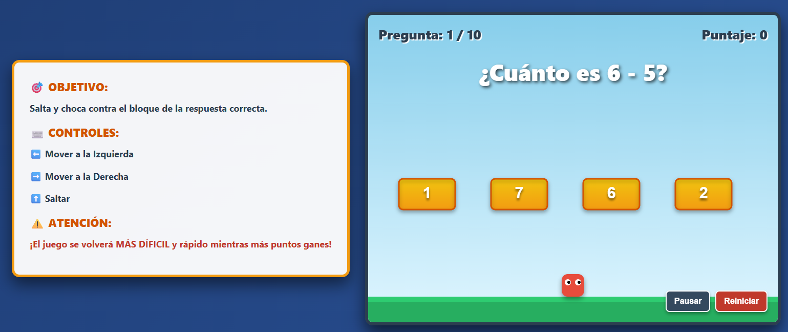
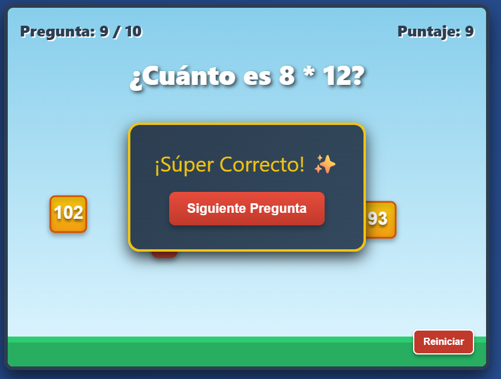
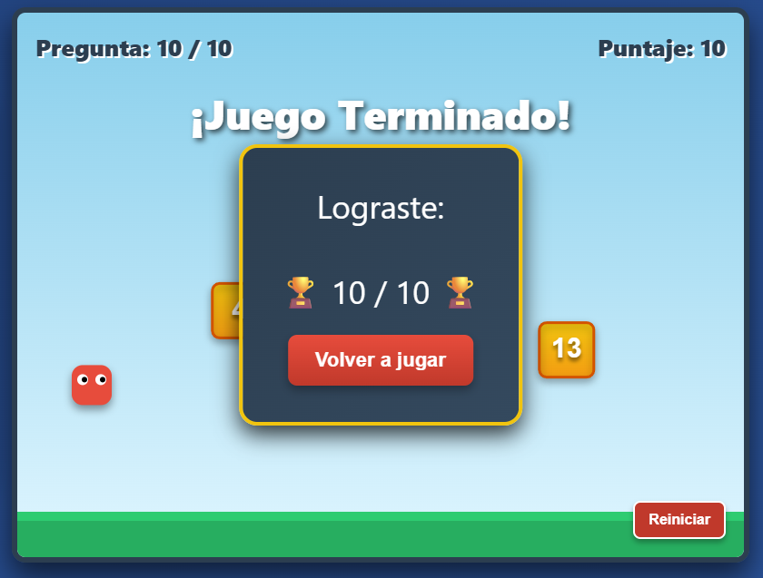

<p align="center">
  <sub>LEVEL 01 · FUNDAMENTOS</sub>
</p>

<h1 align="center">🎮 EduMundo</h1>

<p align="center">
  <code>PLATAFORMAS 2D</code>
  &nbsp; ✦ &nbsp;
  <code>EDUCATIVO</code>
  &nbsp; ✦ &nbsp;
  <code>MATEMÁTICAS</code>
</p>

<p align="center">
  <i>Resolver también es avanzar.</i>
</p>

<br>

<p align="center">
  
</p>

<p align="center">
  <sub>✦ LEVEL 01 ✦</sub>
</p>

<br>

---

## SOBRE EL JUEGO

**EduMundo** es un videojuego educativo de plataformas 2D dirigido a estudiantes de 1.º de secundaria.

Durante la partida, el jugador debe desplazarse por el escenario mientras resuelve **10 operaciones aritméticas**. Cada pregunta presenta cuatro posibles respuestas integradas directamente en los bloques del nivel.

La respuesta no se selecciona desde un menú: el jugador debe identificar la opción correcta, desplazarse hasta ella y golpear el bloque correspondiente.

<p align="center">
  🌐 <b>HTML · CSS · JavaScript</b>
  &nbsp;&nbsp; ✦ &nbsp;&nbsp;
  🎯 <b>10 desafíos</b>
  &nbsp;&nbsp; ✦ &nbsp;&nbsp;
  ⭐ <b>Puntuación /10</b>
</p>

---

## 🎯 OBJETIVO

Completar las **10 operaciones matemáticas** y obtener la mayor puntuación posible.

Cada respuesta correcta suma **1 punto**. Al finalizar todas las preguntas, el juego muestra el resultado obtenido sobre **10 puntos**.

---

## 🧩 MECÁNICA PRINCIPAL

<p align="center">
  <kbd>PREGUNTA</kbd>
  &nbsp; → &nbsp;
  <kbd>DECISIÓN</kbd>
  &nbsp; → &nbsp;
  <kbd>MOVIMIENTO</kbd>
  &nbsp; → &nbsp;
  <kbd>RESPUESTA</kbd>
  &nbsp; → &nbsp;
  <kbd>FEEDBACK</kbd>
</p>

La resolución matemática forma parte directamente del gameplay.

El jugador debe interpretar la operación, reconocer cuál de los cuatro bloques contiene la respuesta correcta y utilizar el movimiento del personaje para alcanzarlo.

Acertar permite sumar un punto y avanzar hacia una nueva pregunta.

---

## CONTROLES

| Control | Acción |
|---|---|
| `←` | Mover hacia la izquierda |
| `→` | Mover hacia la derecha |
| `↑` | Saltar |
| `CLICK` · Pausar / Reanudar | Detener o continuar la partida |
| `CLICK` · Reiniciar | Comenzar nuevamente |

---

## CÓMO FUNCIONA

`01` Se presenta una operación matemática.  
`02` Aparecen cuatro bloques con posibles respuestas.  
`03` El jugador identifica la alternativa que considera correcta.  
`04` Se desplaza y salta hacia el bloque elegido.  
`05` El juego indica si la respuesta es correcta o incorrecta.  
`06` Si la respuesta es correcta, se suma un punto.  
`07` Se genera una nueva operación.  
`08` El proceso continúa hasta completar las 10 preguntas.  
`09` Se muestra la puntuación final sobre 10.

---

## PROGRESIÓN

EduMundo incorpora una dificultad que evoluciona durante la partida.

Al comienzo, las operaciones y plataformas son más sencillas. Conforme avanza el juego:

- las operaciones matemáticas aumentan de dificultad;
- algunas plataformas comienzan a moverse;
- aparecen movimientos verticales;
- ciertos bloques reducen su tamaño;
- alcanzar la respuesta correcta requiere cada vez mayor precisión.

<details>
<summary><b>Ver evolución de la dificultad</b></summary>

<br>

**INICIO**  
Operaciones sencillas y plataformas principalmente estáticas.

**DESARROLLO**  
Las operaciones aumentan de complejidad y comienzan a aparecer plataformas móviles.

**ETAPA AVANZADA**  
Los bloques pueden desplazarse en diferentes direcciones y algunos reducen su tamaño, aumentando la precisión necesaria para responder.

</details>

---

## 🎨 GALERÍA

<p align="center">
  
</p>

<p align="center">
  <sub>🎮 GAMEPLAY</sub>
</p>

<br>

<p align="center">
  
</p>

<p align="center">
  <sub>RESULTADO FINAL</sub>
</p>

---

## DESARROLLO

<p align="center">
  <code>HTML</code>
  &nbsp; ✦ &nbsp;
  <code>CSS</code>
  &nbsp; ✦ &nbsp;
  <code>JavaScript</code>
</p>

**HTML**  
Estructura de la interfaz y elementos del videojuego.

**CSS**  
Diseño visual, distribución de los elementos y presentación de la experiencia.

**JavaScript**  
Movimiento del personaje, generación de preguntas, puntuación, dificultad y lógica general del juego.

El prototipo se encuentra integrado en un archivo:

```text
index.html
```

y puede ejecutarse directamente desde un navegador web.

---

## 🤖 PROCESO CON IA

<p align="center">
  <kbd>DISEÑAR</kbd>
  &nbsp; → &nbsp;
  <kbd>PROMPT</kbd>
  &nbsp; → &nbsp;
  <kbd>PROTOTIPO</kbd>
  &nbsp; → &nbsp;
  <kbd>PRUEBAS</kbd>
  &nbsp; → &nbsp;
  <kbd>ITERACIÓN</kbd>
</p>

**Herramienta utilizada:** `Gemini 1.5 Pro`

La Inteligencia Artificial generativa fue utilizada como una herramienta de apoyo para transformar los requisitos y decisiones de diseño en una primera versión funcional del videojuego.

El proceso comenzó con la definición del público, objetivo, mecánica, preguntas, sistema de puntuación y funcionamiento esperado.

Después de generar el prototipo, se realizaron pruebas para detectar problemas y crear nuevas iteraciones.

<details>
<summary><b>Ver principales iteraciones del prototipo</b></summary>

<br>

### V1 · Plataformas

Las plataformas se encontraban demasiado elevadas para el personaje.

**Cambio**  
Se modificaron sus posiciones para permitir que el jugador pudiera alcanzar correctamente los bloques.

---

### V2 · Control de la partida

El jugador no tenía una forma rápida de detener o comenzar nuevamente la partida.

**Cambio**  
Se incorporaron las opciones **Pausar/Reanudar** y **Reiniciar**.

---

### V3 · Instrucciones

Los jugadores nuevos no sabían inmediatamente cuál era el objetivo ni cómo controlar al personaje.

**Cambio**  
Se incorporó un panel permanente con las instrucciones y controles necesarios para jugar.

---

### V4 · Interfaz

El panel de instrucciones ocupaba parte del área de juego y podía interferir visualmente con el personaje.

**Cambio**  
Las instrucciones fueron reorganizadas fuera del escenario principal.

---

### V5 · Dificultad dinámica

La dificultad permanecía prácticamente igual desde la primera hasta la última pregunta.

**Cambio**  
Las operaciones aumentaron de complejidad y las plataformas comenzaron a moverse conforme progresaba la partida.

---

### V6 · Precisión

Los niveles avanzados todavía podían resultar sencillos.

**Cambio**  
Se incorporaron movimientos adicionales y bloques de menor tamaño para exigir mayor precisión al jugador.

</details>

---

## 🔁 LO QUE APRENDÍ

Este proyecto me permitió comprender que una actividad educativa puede integrarse directamente dentro de una **mecánica de videojuego** en lugar de funcionar como un ejercicio separado.

Durante el desarrollo trabajé principalmente en:

<p align="center">
  <code>requisitos</code>
  &nbsp; ✦ &nbsp;
  <code>mecánicas</code>
  &nbsp; ✦ &nbsp;
  <code>feedback</code>
  &nbsp; ✦ &nbsp;
  <code>puntuación</code>
  &nbsp; ✦ &nbsp;
  <code>dificultad</code>
  &nbsp; ✦ &nbsp;
  <code>testing</code>
</p>

También comprendí la importancia de **probar, detectar problemas e iterar**, en lugar de considerar la primera versión del prototipo como el resultado definitivo.

---

## 🚀 SIGUIENTE NIVEL

En una próxima versión me gustaría explorar:

- mayor variedad de niveles;
- nuevos tipos de operaciones;
- más feedback visual y sonoro;
- diferentes escenarios;
- almacenamiento de récords y puntuaciones;
- una mejor adaptación a dispositivos móviles.

---

## EJECUCIÓN

Actualmente EduMundo puede ejecutarse localmente abriendo:

```text
index.html
```

<br>

---

<p align="center">
  <sub>✦ ✦ ✦</sub>
</p>

<p align="center">
  <b>🎮 LEVEL 01 COMPLETE</b>
</p>

<p align="center">
  <sub>Fundamentos desbloqueados</sub>
</p>

<br>

<p align="center">
  <a href="../../README.md">← VOLVER AL PORTAFOLIO</a>
</p>