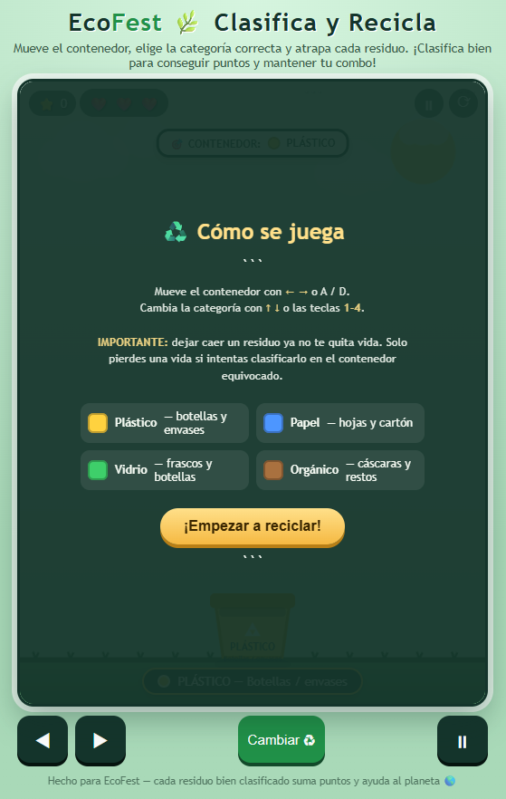
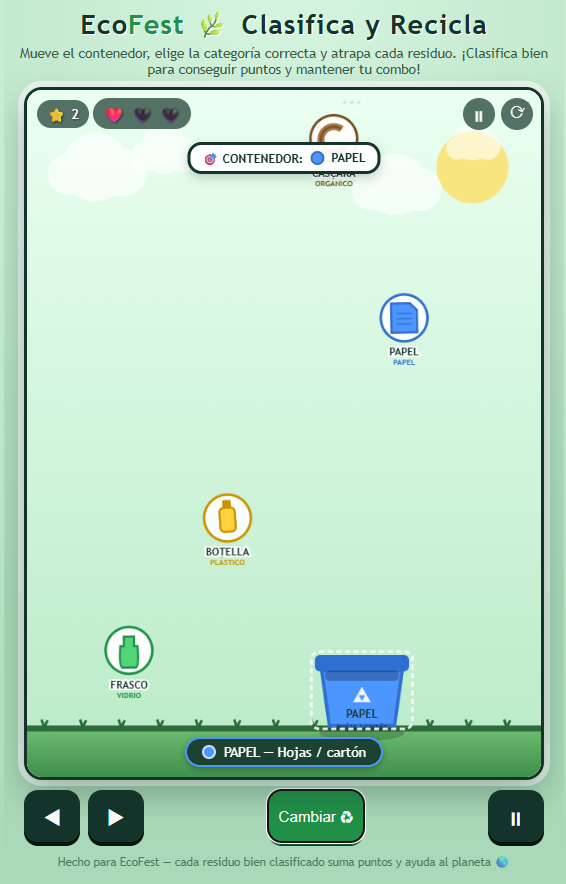
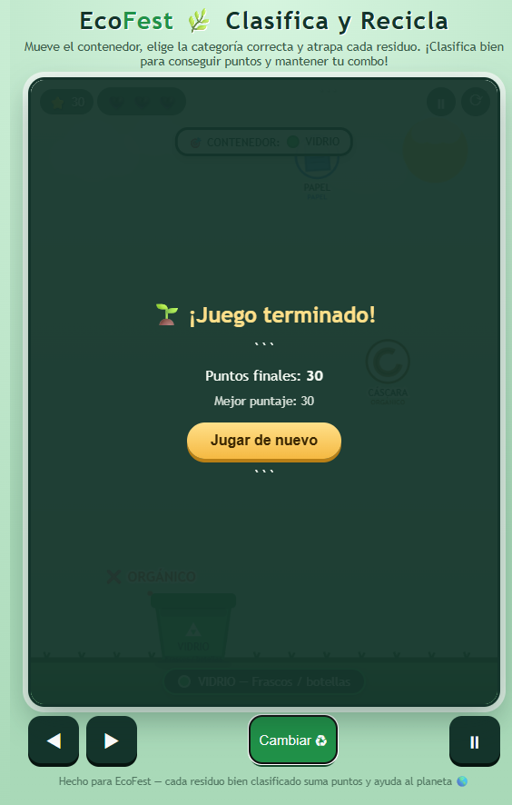

<p align="center">
  <sub>LEVEL 02 · PROCESO DE DESARROLLO</sub>
</p>

<h1 align="center">♻️ EcoFest</h1>

<p align="center">
  <code>CASUAL</code>
  &nbsp; ✦ &nbsp;
  <code>RECICLAJE</code>
  &nbsp; ✦ &nbsp;
  <code>SCORE</code>
</p>

<p align="center">
  <i>Clasificar bien también puede ser un desafío.</i>
</p>

<br>

<p align="center">
  
</p>

<p align="center">
  <sub>✦ LEVEL 02 ✦</sub>
</p>

<br>

---

<h2 align="center">♻️ SOBRE EL JUEGO</h2>

<p align="center">
  <sub>Reconocer, decidir y clasificar antes de que sea demasiado tarde.</sub>
</p>

**EcoFest** es un videojuego casual educativo centrado en la clasificación correcta de residuos.

Durante la partida diferentes objetos caen desde la parte superior de la pantalla. El jugador debe mover su contenedor y seleccionar la categoría adecuada antes de atrapar cada residuo.

El objetivo es conseguir la mayor puntuación posible mientras la velocidad y frecuencia de aparición de los objetos aumentan progresivamente.

<p align="center">
  🌐 <b>HTML · CSS · JavaScript</b>
  &nbsp;&nbsp; ✦ &nbsp;&nbsp;
  ♻️ <b>4 categorías</b>
  &nbsp;&nbsp; ✦ &nbsp;&nbsp;
  ❤️ <b>3 vidas</b>
</p>

<br>

---

<h2 align="center">🎯 OBJETIVO</h2>

<p align="center">
  Clasificar correctamente la mayor cantidad de residuos y conseguir el mejor récord posible.
</p>

EcoFest no tiene una meta final fija.

La partida continúa mientras el jugador conserve sus vidas, por lo que el desafío consiste en **mantenerse jugando y aumentar progresivamente la puntuación**.

<br>

---

<h2 align="center">🧩 MECÁNICA PRINCIPAL</h2>

<p align="center">
  <kbd>OBSERVAR</kbd>
  &nbsp; → &nbsp;
  <kbd>CLASIFICAR</kbd>
  &nbsp; → &nbsp;
  <kbd>MOVER</kbd>
  &nbsp; → &nbsp;
  <kbd>ATRAPAR</kbd>
  &nbsp; → &nbsp;
  <kbd>PUNTUAR</kbd>
</p>

<br>

Cada residuo pertenece a una categoría determinada.

El jugador debe identificarla rápidamente, seleccionar el tipo correcto de contenedor y posicionarse debajo del objeto antes de que continúe cayendo.

Una clasificación correcta aumenta la puntuación y permite construir un **combo**.

Seleccionar una categoría incorrecta y atrapar el residuo provoca la pérdida de una vida.

---

## CONTROLES

| Control | Acción |
|---|---|
| `←` `→` | Mover el contenedor |
| `A` `D` | Movimiento alternativo |
| `↑` `↓` | Cambiar categoría |
| `1` `2` `3` `4` | Seleccionar directamente una categoría |
| `ESPACIO` | Pausar / continuar |
| `R` | Reiniciar la partida |
| `CLICK / TOUCH` | Utilizar los controles visibles en pantalla |

---

## CÓMO FUNCIONA

`01` El juego indica la categoría activa del contenedor.  
`02` Diferentes residuos comienzan a caer desde la parte superior.  
`03` El jugador identifica a qué categoría pertenece cada objeto.  
`04` Puede cambiar el tipo de contenedor antes de atraparlo.  
`05` Mueve el contenedor horizontalmente hacia el residuo.  
`06` Una clasificación correcta aumenta la puntuación y el combo.  
`07` Una clasificación incorrecta elimina una vida.  
`08` Al perder las 3 vidas termina la partida.  
`09` El resultado final permite comparar el puntaje obtenido con el mejor récord.

---

## PROGRESIÓN

El desafío aumenta conforme crece la puntuación.

A medida que el jugador consigue más puntos:

- los residuos aparecen con mayor frecuencia;
- la velocidad de caída aumenta;
- hay menos tiempo para identificar la categoría;
- mantener combos consecutivos exige mayor precisión;
- la toma de decisiones se vuelve progresivamente más rápida.

<details>
<summary><b>✦ Ver evolución de la dificultad</b></summary>

<br>

**INICIO**  
La velocidad permite reconocer con facilidad los residuos y familiarizarse con las categorías.

**DESARROLLO**  
Los objetos comienzan a aparecer con mayor frecuencia y disminuye el tiempo disponible para reaccionar.

**ETAPA AVANZADA**  
La velocidad exige combinar rápidamente identificación, selección de categoría y movimiento.

</details>

<br>

---

<h2 align="center">🎨 GALERÍA</h2>

<p align="center">
  <sub>Clasificar correctamente antes de perder una vida.</sub>
</p>

<br>

<p align="center">
  
</p>

<p align="center">
  <sub>♻️ GAMEPLAY</sub>
</p>

<br>

<p align="center">
  
</p>

<p align="center">
  <sub>⭐ RESULTADO FINAL</sub>
</p>

<br>

---

## DESARROLLO

<p align="center">
  <code>HTML</code>
  &nbsp; ✦ &nbsp;
  <code>CSS</code>
  &nbsp; ✦ &nbsp;
  <code>JavaScript</code>
</p>

**HTML**  
Estructura de la interfaz, controles y elementos necesarios para ejecutar el videojuego.

**CSS**  
Diseño visual, distribución del escenario, contenedores, overlays y elementos de interfaz.

**JavaScript**  
Movimiento, generación de residuos, categorías, colisiones, puntuación, combos, vidas y progresión de dificultad.

El prototipo se encuentra integrado en un único archivo:

```text
index.html
```

---

<h2 align="center">🤖 PROCESO CON IA</h2>

<p align="center">
  <sub>Del diseño previo a un prototipo jugable.</sub>
</p>

<p align="center">
  <kbd>PREPRODUCCIÓN</kbd>
  &nbsp; → &nbsp;
  <kbd>PROMPT</kbd>
  &nbsp; → &nbsp;
  <kbd>PROTOTIPO</kbd>
  &nbsp; → &nbsp;
  <kbd>VALIDACIÓN</kbd>
</p>

<br>

La Inteligencia Artificial generativa se utilizó como herramienta de apoyo durante la etapa de producción.

Antes de generar el prototipo se definieron elementos como:

`género` · `objetivo` · `mecánica` · `reglas` · `victoria` · `derrota` · `público`

A partir de estas decisiones se construyó un prompt destinado a generar la estructura funcional del videojuego.

Posteriormente, EcoFest fue probado para comprobar que la mecánica pudiera comprenderse y que el juego cumpliera su propósito educativo.


---

<h2 align="center">🔁 LO QUE APRENDÍ</h2>

<p align="center">
  <i>Un videojuego comienza mucho antes de escribir código.</i>
</p>

EcoFest me permitió trabajar el desarrollo como un **proceso compuesto por diferentes etapas**, en lugar de pensar únicamente en la programación del resultado final.

<p align="center">
  <kbd>PREPRODUCCIÓN</kbd>
  &nbsp; → &nbsp;
  <kbd>PRODUCCIÓN</kbd>
  &nbsp; → &nbsp;
  <kbd>TESTEO</kbd>
  &nbsp; → &nbsp;
  <kbd>LANZAMIENTO</kbd>
</p>

<br>

Durante la práctica trabajé principalmente en:

<p align="center">
  <code>planificación</code>
  &nbsp; ✦ &nbsp;
  <code>mecánicas</code>
  &nbsp; ✦ &nbsp;
  <code>producción</code>
  &nbsp; ✦ &nbsp;
  <code>testing</code>
  &nbsp; ✦ &nbsp;
  <code>validación</code>
</p>

También comprendí que las decisiones tomadas durante la preproducción sirven como referencia para comprobar posteriormente si el prototipo realmente cumple con lo que se había planteado.

---

<h2 align="center">🚀 SIGUIENTE NIVEL</h2>

<p align="center">
  <sub>Ideas para ampliar el desafío y la experiencia de reciclaje.</sub>
</p>

En una próxima versión me gustaría explorar:

- mayor variedad de residuos;
- nuevas categorías de reciclaje;
- diferentes escenarios;
- niveles o modos de dificultad;
- efectos de sonido y feedback adicional;
- sistema persistente de récords;
- desafíos especiales o eventos temporales.

<br>

---

## EJECUCIÓN

EcoFest puede jugarse directamente desde el navegador sin instalar software adicional.

<br>

<p align="center">
  <a href="https://melaniquintelaaguilar.github.io/game-development-portfolio/juegos/02-ecofest/">
    <b>♻️ JUGAR ECOFEST</b>
  </a>
</p>

<p align="center">
  <sub>Disponible mediante GitHub Pages</sub>
</p>

<br>

---

<p align="center">
  <sub>✦ ✦ ✦</sub>
</p>

<p align="center">
  <b>♻️ LEVEL 02 COMPLETE</b>
</p>

<p align="center">
  <sub>Proceso de desarrollo desbloqueado</sub>
</p>

<br>

<p align="center">
  <a href="../../README.md">← VOLVER AL PORTAFOLIO</a>
</p>