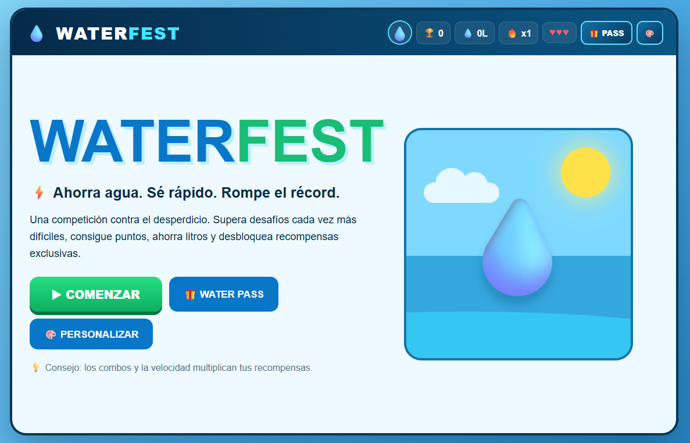
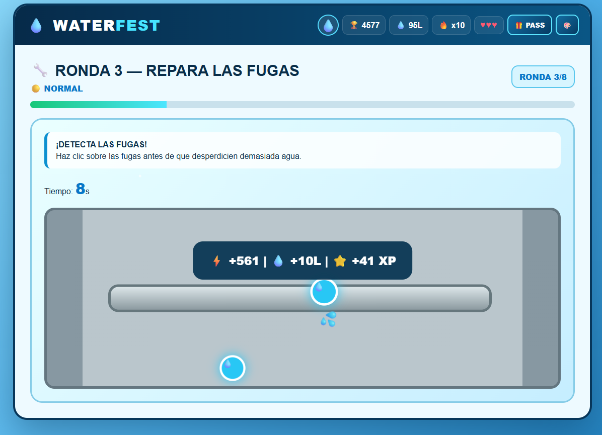
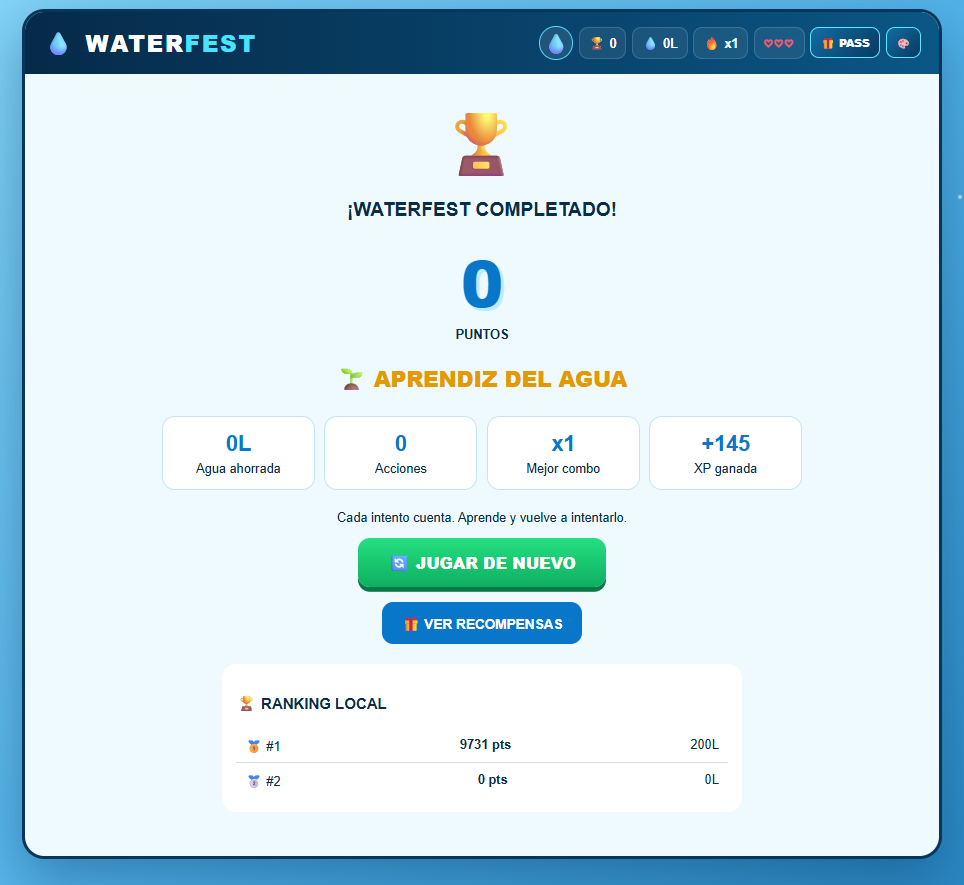

<p align="center">
  <sub>LEVEL 04 · PLAYER PERSONA</sub>
</p>

<h1 align="center">💧 WaterFest</h1>

<p align="center">
  <code>MINIJUEGOS</code>
  &nbsp; ✦ &nbsp;
  <code>PLAYER PERSONA</code>
  &nbsp; ✦ &nbsp;
  <code>AHORRO DE AGUA</code>
</p>

<p align="center">
  <i>Ahorrar más. Reaccionar más rápido. Superar tu propio récord.</i>
</p>

<br>

<p align="center">
  
</p>

<p align="center">
  <sub>✦ LEVEL 04 ✦</sub>
</p>

<br>

---

<h2 align="center">💧 SOBRE EL JUEGO</h2>

<p align="center">
  <sub>Una experiencia diseñada pensando primero en quién va a jugarla.</sub>
</p>

**WaterFest** es un videojuego educativo compuesto por diferentes minijuegos relacionados con el uso responsable del agua.

El jugador debe superar desafíos rápidos como cerrar grifos, reparar fugas, reducir el tiempo de ducha, reconocer hábitos responsables y reaccionar ante diferentes objetivos.

Cada acción permite conseguir puntos, ahorrar litros de agua y construir combos mientras las rondas aumentan progresivamente su dificultad.

<p align="center">
  🌐 <b>HTML · CSS · JavaScript</b>
  &nbsp;&nbsp; ✦ &nbsp;&nbsp;
  💧 <b>Agua ahorrada</b>
  &nbsp;&nbsp; ✦ &nbsp;&nbsp;
  🏆 <b>Récord y ranking</b>
</p>

<br>

---

<h2 align="center">🎯 OBJETIVO</h2>

<p align="center">
  Ahorrar la mayor cantidad de agua posible mientras se superan los diferentes desafíos.
</p>

El jugador debe mantener una buena puntuación, reaccionar rápidamente y evitar acciones que representen desperdicio.

WaterFest recompensa la eficiencia mediante **puntos, combos, litros ahorrados, XP y rangos**.

Al completar las rondas se obtiene un resultado final que permite comparar el desempeño conseguido con partidas anteriores.

<br>

---

<h2 align="center">🧩 MECÁNICA PRINCIPAL</h2>

<p align="center">
  <kbd>OBSERVAR</kbd>
  &nbsp; → &nbsp;
  <kbd>DECIDIR</kbd>
  &nbsp; → &nbsp;
  <kbd>REACCIONAR</kbd>
  &nbsp; → &nbsp;
  <kbd>AHORRAR</kbd>
  &nbsp; → &nbsp;
  <kbd>SUPERAR</kbd>
</p>

<br>

WaterFest utiliza una colección de **minijuegos breves** que representan diferentes situaciones relacionadas con el consumo de agua.

Cada ronda presenta una acción distinta, pero todas comparten una misma idea: responder de forma rápida y eficiente para reducir el desperdicio.

El jugador obtiene mejores resultados cuando combina:

- rapidez;
- precisión;
- buenas decisiones;
- acciones consecutivas;
- ahorro de agua.

---

## CONTROLES

WaterFest está diseñado principalmente para jugarse mediante interacción directa con la interfaz.

| Control | Acción |
|---|---|
| `CLICK / TOUCH` | Interactuar con los minijuegos |
| `CLICK` · Grifo | Cerrar un grifo abierto |
| `CLICK` · Fuga | Reparar una fuga |
| `CLICK` · Gota | Atrapar objetivos en los desafíos de reflejos |
| `CLICK` · Acción | Seleccionar un hábito |
| `CLICK` · Ahorrar / Desperdiciar | Clasificar el hábito seleccionado |
| `CLICK` · Cerrar ducha | Finalizar el desafío de ducha |

No se requieren controles de teclado para completar las rondas principales.

---

## CÓMO FUNCIONA

`01` La partida comienza con 3 vidas y una puntuación inicial de 0.  
`02` Se presenta uno de los minijuegos disponibles.  
`03` El jugador lee rápidamente el objetivo de la ronda.  
`04` Debe completar el desafío mediante clic o touch.  
`05` Las acciones correctas aumentan puntos, agua ahorrada y combo.  
`06` Los errores pueden reducir la puntuación o hacer perder vidas.  
`07` Al terminar una ronda se obtiene XP y comienza la siguiente.  
`08` La dificultad aumenta conforme avanza la campaña.  
`09` Después de completar las rondas se calcula el resultado final y el rango obtenido.

---

## PROGRESIÓN

WaterFest está organizado en **8 rondas** que alternan diferentes tipos de desafío.

<p align="center">
  <kbd>DUCHA</kbd>
  &nbsp; ✦ &nbsp;
  <kbd>GRIFOS</kbd>
  &nbsp; ✦ &nbsp;
  <kbd>FUGAS</kbd>
  &nbsp; ✦ &nbsp;
  <kbd>HÁBITOS</kbd>
  &nbsp; ✦ &nbsp;
  <kbd>REFLEJOS</kbd>
</p>

A medida que aumenta el número de ronda:

- disminuye el tiempo disponible;
- aparecen más objetivos;
- los desafíos requieren mayor rapidez;
- los objetivos de reflejos se vuelven más pequeños;
- mantener combos se vuelve más exigente;
- los errores tienen mayor impacto en el resultado.

<details>
<summary><b>✦ Ver los tipos de desafío</b></summary>

<br>

**🚿 Ducha Speedrun**  
El jugador debe cerrar la ducha rápidamente para reducir el desperdicio de agua.

**🚰 Cierra los grifos**  
Varios grifos aparecen abiertos y deben cerrarse antes de que termine el tiempo.

**🔧 Repara las fugas**  
El jugador debe localizar y pulsar las fugas antes de que desperdicien demasiada agua.

**🪣 Ahorra o desperdicia**  
Se presentan diferentes hábitos cotidianos que deben clasificarse según ayuden a ahorrar o desperdicien agua.

**⚡ Reflejos**  
El jugador debe atrapar gotas rápidamente mientras intenta construir y mantener un combo.

</details>

<br>

---

<h2 align="center">🎨 GALERÍA</h2>

<p align="center">
  <sub>Desafíos rápidos, decisiones y ahorro en cada ronda.</sub>
</p>

<br>

<p align="center">
  
</p>

<p align="center">
  <sub>💧 GAMEPLAY</sub>
</p>

<br>

<p align="center">
  
</p>

<p align="center">
  <sub>🏆 RESULTADO FINAL</sub>
</p>

<br>

---

## DESARROLLO

<p align="center">
  <code>HTML</code>
  &nbsp; ✦ &nbsp;
  <code>CSS</code>
  &nbsp; ✦ &nbsp;
  <code>JavaScript</code>
</p>

**HTML**  
Estructura de las pantallas, HUD, minijuegos, modales y controles de interacción.

**CSS**  
Diseño visual de escenarios, estados, recompensas, animaciones e interfaz.

**JavaScript**  
Gestión de rondas, temporizadores, puntuación, vidas, combos, XP, agua ahorrada, ranking y comportamiento de los diferentes minijuegos.

El prototipo se encuentra integrado en un único archivo:

```text
index.html
```

---

<h2 align="center">👤 DISEÑO PARA EL JUGADOR</h2>

<p align="center">
  <sub>No diseñar para todos. Diseñar para alguien.</sub>
</p>

WaterFest fue construido a partir de un **Player Persona** orientado a jóvenes de 18 a 25 años.

Antes de definir el videojuego se analizaron elementos como:

<p align="center">
  <code>objetivos</code>
  &nbsp; ✦ &nbsp;
  <code>motivaciones</code>
  &nbsp; ✦ &nbsp;
  <code>frustraciones</code>
  &nbsp; ✦ &nbsp;
  <code>hábitos</code>
</p>

El perfil planteado buscaba experiencias breves y dinámicas, valoraba los desafíos y respondía a incentivos como puntos, competencia y recompensas digitales.

Por eso WaterFest incorpora:

**⚡ Desafíos breves**  
Las rondas requieren acciones rápidas y concretas.

**🏆 Puntuación y récords**  
El jugador puede intentar superar sus resultados anteriores.

**🔥 Combos**  
Las buenas acciones consecutivas aumentan la sensación de progreso.

**⭐ XP y recompensas**  
La partida entrega experiencia que permite avanzar dentro del Water Pass.

**🎨 Personalización**  
Las recompensas desbloqueadas pueden utilizarse para modificar distintos elementos visuales.

**💧 Resultado visible**  
El jugador puede observar directamente cuántos litros de agua consiguió ahorrar.

---

<h2 align="center">🤖 PROCESO CON IA</h2>

<p align="center">
  <sub>El Player Persona primero. El prototipo después.</sub>
</p>

<p align="center">
  <kbd>PLAYER PERSONA</kbd>
  &nbsp; → &nbsp;
  <kbd>DECISIONES</kbd>
  &nbsp; → &nbsp;
  <kbd>PROMPT</kbd>
  &nbsp; → &nbsp;
  <kbd>PROTOTIPO</kbd>
  &nbsp; → &nbsp;
  <kbd>VALIDACIÓN</kbd>
</p>

<br>

La Inteligencia Artificial generativa se utilizó como herramienta de apoyo durante la producción.

El prompt debía incorporar tanto las características del videojuego como el perfil definido previamente para el jugador.

De esta forma, la generación del prototipo partió de decisiones relacionadas con:

- necesidades;
- motivaciones;
- frustraciones;
- hábitos;
- recompensas;
- duración de los desafíos;
- experiencia esperada.

Posteriormente, el prototipo fue probado por otros equipos para comprobar que **realmente se sintiera diseñado para el Player Persona definido y no como una experiencia genérica**.

> La práctica registra el uso de una IA para producir el prototipo, pero no especifica el nombre de la herramienta utilizada.

---

<h2 align="center">🔁 LO QUE APRENDÍ</h2>

<p align="center">
  <i>Antes de preguntarme qué juego hacer, también debo preguntarme para quién lo estoy haciendo.</i>
</p>

WaterFest me permitió comprender que conocer al jugador puede modificar directamente las decisiones de diseño.

Un Player Persona no funciona solamente como una descripción del público: sirve para justificar **cómo debería sentirse, funcionar y recompensar una experiencia**.

<p align="center">
  <kbd>JUGADOR</kbd>
  &nbsp; → &nbsp;
  <kbd>NECESIDAD</kbd>
  &nbsp; → &nbsp;
  <kbd>DECISIÓN DE DISEÑO</kbd>
  &nbsp; → &nbsp;
  <kbd>EXPERIENCIA</kbd>
</p>

<br>

Durante la práctica trabajé principalmente en:

<p align="center">
  <code>Player Persona</code>
  &nbsp; ✦ &nbsp;
  <code>motivaciones</code>
  &nbsp; ✦ &nbsp;
  <code>pain points</code>
  &nbsp; ✦ &nbsp;
  <code>recompensas</code>
  &nbsp; ✦ &nbsp;
  <code>validación</code>
</p>

También aprendí que una mecánica puede ser funcional y aun así no ser adecuada si **no responde a las características de la persona para la que fue diseñada**.

<br>

---

<h2 align="center">🚀 SIGUIENTE NIVEL</h2>

<p align="center">
  <sub>Ideas para hacer la experiencia todavía más personal y competitiva.</sub>
</p>

En una próxima versión me gustaría explorar:

- mayor variedad de minijuegos;
- desafíos diarios;
- ranking online entre jugadores;
- más recompensas y elementos personalizables;
- nuevos niveles dentro del sistema de progreso;
- mayor feedback visual y sonoro;
- estadísticas de ahorro acumulado;
- retos competitivos entre amigos.

<br>

---

## EJECUCIÓN

WaterFest puede jugarse directamente desde el navegador sin instalar software adicional.

<br>

<p align="center">
  <a href="https://melaniquintelaaguilar.github.io/game-development-portfolio/juegos/04-waterfest/">
    <b>💧 JUGAR WATERFEST</b>
  </a>
</p>

<p align="center">
  <sub>Disponible mediante GitHub Pages</sub>
</p>

<br>

---

<p align="center">
  <sub>✦ ✦ ✦</sub>
</p>

<p align="center">
  <b>💧 LEVEL 04 COMPLETE</b>
</p>

<p align="center">
  <sub>Player Persona desbloqueado</sub>
</p>

<br>

<p align="center">
  <a href="../../README.md">← VOLVER AL PORTAFOLIO</a>
</p>