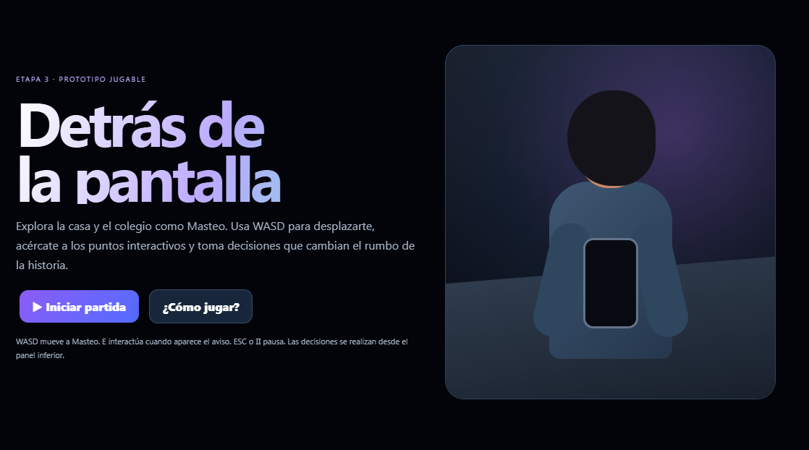
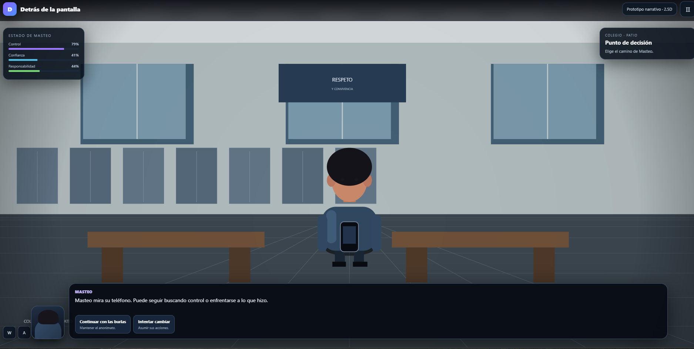
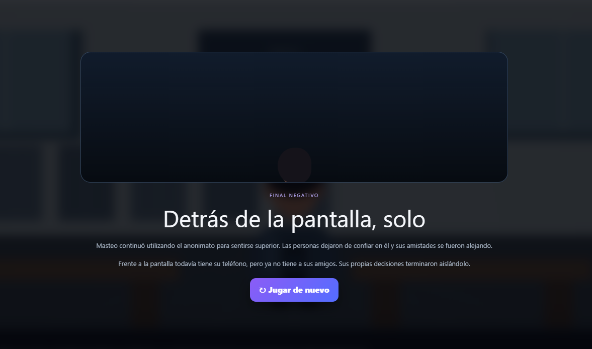

<p align="center">
  <sub>LEVEL 05 · STORYTELLING</sub>
</p>

<h1 align="center">💬 Detrás de la pantalla</h1>

<p align="center">
  <code>NARRATIVO</code>
  &nbsp; ✦ &nbsp;
  <code>STORYTELLING</code>
  &nbsp; ✦ &nbsp;
  <code>DECISIONES</code>
</p>

<p align="center">
  <i>Detrás de cada decisión hay una consecuencia.</i>
</p>

<br>

<p align="center">
  
</p>

<p align="center">
  <sub>✦ LEVEL 05 ✦</sub>
</p>

<br>

---

<h2 align="center">💬 SOBRE EL JUEGO</h2>

<p align="center">
  <sub>Una historia que cambia según lo que decides hacer.</sub>
</p>

**Detrás de la pantalla** es un prototipo narrativo centrado en las consecuencias del ciberbullying.

El jugador controla a **Masteo**, un joven que utiliza una cuenta anónima para molestar a otras personas en redes sociales sin considerar inicialmente el efecto real de sus acciones.

La historia cambia cuando descubre que una de las personas afectadas es alguien muy cercano a él.

A partir de ese momento, las decisiones del jugador determinan si Masteo continúa buscando control mediante el anonimato o comienza a asumir responsabilidad por lo ocurrido.

<p align="center">
  🌐 <b>HTML · CSS · JavaScript</b>
  &nbsp;&nbsp; ✦ &nbsp;&nbsp;
  📖 <b>Narrativa emergente</b>
  &nbsp;&nbsp; ✦ &nbsp;&nbsp;
  🔀 <b>2 caminos principales</b>
</p>

<br>

---

<h2 align="center">🎯 OBJETIVO</h2>

<p align="center">
  Explorar la historia de Masteo y experimentar cómo sus decisiones modifican sus relaciones y su desenlace.
</p>

Detrás de la pantalla no plantea el objetivo como una puntuación tradicional.

El progreso ocurre a través de la **exploración, interacción y toma de decisiones**.

Cada elección modifica el estado del personaje y conduce progresivamente hacia diferentes consecuencias narrativas.

<br>

---

<h2 align="center">🧩 MECÁNICA PRINCIPAL</h2>

<p align="center">
  <kbd>EXPLORAR</kbd>
  &nbsp; → &nbsp;
  <kbd>INTERACTUAR</kbd>
  &nbsp; → &nbsp;
  <kbd>DECIDIR</kbd>
  &nbsp; → &nbsp;
  <kbd>OBSERVAR</kbd>
  &nbsp; → &nbsp;
  <kbd>AFRONTAR</kbd>
</p>

<br>

La mecánica central es la **toma de decisiones narrativas**.

El jugador explora diferentes espacios, interactúa con elementos de la escena y selecciona respuestas que afectan tres variables:

<p align="center">
  <code>CONTROL</code>
  &nbsp; ✦ &nbsp;
  <code>CONFIANZA</code>
  &nbsp; ✦ &nbsp;
  <code>RESPONSABILIDAD</code>
</p>

Estas variables representan el estado de Masteo y ayudan a visualizar cómo sus acciones modifican su relación consigo mismo y con quienes lo rodean.

---

## CONTROLES

| Control | Acción |
|---|---|
| `W` | Mover hacia arriba |
| `A` | Mover hacia la izquierda |
| `S` | Mover hacia abajo |
| `D` | Mover hacia la derecha |
| `E` | Interactuar cuando aparece el aviso |
| `ESC` | Pausar / reanudar |
| `CLICK` · Decisión | Seleccionar una respuesta narrativa |
| `CLICK` · Botón de pausa | Pausar desde la interfaz |
| `CLICK` · Reiniciar | Reiniciar la historia |

---

## CÓMO FUNCIONA

`01` El jugador comienza controlando a Masteo en su habitación.  
`02` Explora el espacio y revisa su actividad en redes sociales.  
`03` La historia presenta diferentes situaciones y decisiones.  
`04` Cada elección modifica Control, Confianza o Responsabilidad.  
`05` La historia se traslada posteriormente al colegio.  
`06` Masteo comienza a observar las consecuencias de sus acciones.  
`07` Descubre quién estaba detrás de la persona afectada.  
`08` El jugador debe elegir cómo responder ante lo sucedido.  
`09` La historia se divide en diferentes caminos.  
`10` Las decisiones conducen a uno de los desenlaces principales.

---

## ESTRUCTURA NARRATIVA

Detrás de la pantalla utiliza una **narrativa emergente**.

La historia posee acontecimientos definidos, pero permite que el jugador tome decisiones que modifican el rumbo del personaje.

<p align="center">
  <kbd>INICIO</kbd>
  &nbsp; → &nbsp;
  <kbd>DESCUBRIMIENTO</kbd>
  &nbsp; → &nbsp;
  <kbd>DECISIÓN</kbd>
  &nbsp; → &nbsp;
  <kbd>CONSECUENCIA</kbd>
</p>

<br>

<details>
<summary><b>✦ Ver estructura de la historia</b></summary>

<br>

**INICIO · La cuenta anónima**

Masteo utiliza el anonimato como una forma de sentirse en control y molestar a otras personas.

---

**CAMBIO · Algo no encaja**

Su mejor amiga comienza a faltar y Masteo descubre que algo está ocurriendo fuera de la pantalla.

---

**REVELACIÓN · La verdad**

Masteo comprende que la persona que estaba siendo afectada por su cuenta anónima era alguien cercano a él.

---

**PUNTO DE DECISIÓN**

El jugador puede elegir entre:

`CONTINUAR CON LAS BURLAS`

o

`INTENTAR CAMBIAR`

---

**CONSECUENCIA**

Cada camino produce cambios distintos en la confianza, responsabilidad y relaciones de Masteo.

</details>

<br>

---

<h2 align="center">📖 ARCO DEL PERSONAJE</h2>

<p align="center">
  <sub>El cambio de Masteo depende de lo que el jugador decide hacer con la verdad.</sub>
</p>

**Al inicio**  
Masteo busca control a través del anonimato y no reconoce completamente el efecto que sus acciones tienen sobre otras personas.

**El punto de ruptura**  
Descubre que las consecuencias de su comportamiento afectan directamente a alguien cercano.

**Después de la revelación**  
El jugador decide qué camino tomará.

<p align="center">
  <kbd>NEGAR / CONTINUAR</kbd>
  &nbsp;&nbsp; ↙ &nbsp;&nbsp; ✦ &nbsp;&nbsp; ↘ &nbsp;&nbsp;
  <kbd>ASUMIR / CAMBIAR</kbd>
</p>

El arco no se completa únicamente mediante diálogos. Las acciones posteriores de Masteo muestran si realmente continúa buscando control o comienza a asumir responsabilidad.

---

<h2 align="center">🔀 DECISIONES Y CONSECUENCIAS</h2>

<p align="center">
  <sub>Elegir no cambia solo el diálogo. Cambia la relación del personaje con los demás.</sub>
</p>

Las decisiones del jugador modifican:

**Control**  
Representa cuánto intenta Masteo mantener poder sobre las situaciones y las personas.

**Confianza**  
Refleja cómo evolucionan sus vínculos con quienes lo rodean.

**Responsabilidad**  
Representa hasta qué punto reconoce las consecuencias de sus propias acciones.

<details>
<summary><b>✦ Ver posibles desenlaces</b></summary>

<br>

### Camino de continuidad

Masteo decide mantener el anonimato y continuar con su comportamiento.

Sus relaciones comienzan a deteriorarse y las personas que lo rodean pierden confianza en él.

El desenlace enfatiza las consecuencias de sus propias decisiones.

---

### Camino de cambio

Masteo reconoce lo ocurrido, abandona la cuenta anónima e intenta actuar de manera diferente.

El cambio no elimina lo sucedido, pero comienza un proceso de reparación mediante acciones concretas y nuevas relaciones basadas en confianza.

</details>

<br>

---

<h2 align="center">🎭 SHOW, DON'T TELL</h2>

<p align="center">
  <i>La consecuencia se muestra antes de explicarse.</i>
</p>

Uno de los objetivos principales de Detrás de la pantalla fue aplicar el principio **show, don't tell**.

En lugar de detener la historia para explicar directamente que el ciberbullying tiene consecuencias, el jugador puede observarlas mediante:

- la ausencia de la amiga;
- los cambios en las relaciones;
- la pérdida de confianza;
- las conversaciones del teléfono;
- el comportamiento de otros personajes;
- el aislamiento o reconstrucción de vínculos;
- las consecuencias de las decisiones tomadas.

De esta forma, el mensaje se comunica principalmente mediante **situaciones, acciones y resultados narrativos**.

---

<h2 align="center">🎨 GALERÍA</h2>

<p align="center">
  <sub>Explorar una historia también significa observar lo que cambia.</sub>
</p>

<br>

<p align="center">
  
</p>

<p align="center">
  <sub>💬 GAMEPLAY</sub>
</p>

<br>

<p align="center">
  
</p>

<p align="center">
  <sub>🔀 DESENLACE</sub>
</p>

<br>

---

## DESARROLLO

<p align="center">
  <code>HTML</code>
  &nbsp; ✦ &nbsp;
  <code>CSS</code>
  &nbsp; ✦ &nbsp;
  <code>JavaScript</code>
</p>

**HTML**  
Estructura de las pantallas, diálogos, decisiones, HUD y elementos narrativos.

**CSS**  
Diseño de escenarios, personajes, teléfono, paneles e interfaz del prototipo.

**JavaScript**  
Movimiento, escenas, decisiones, variables narrativas, cambios de estado y selección de desenlaces.

El prototipo se encuentra integrado en un único archivo:

```text
index.html
```

---

<h2 align="center">🤖 PROCESO CON IA</h2>

<p align="center">
  <sub>Primero construir la historia. Después convertirla en experiencia.</sub>
</p>

<p align="center">
  <kbd>PERSONAJE</kbd>
  &nbsp; → &nbsp;
  <kbd>ARCO</kbd>
  &nbsp; → &nbsp;
  <kbd>DECISIONES</kbd>
  &nbsp; → &nbsp;
  <kbd>STORYTELLING</kbd>
  &nbsp; → &nbsp;
  <kbd>PROTOTIPO</kbd>
</p>

<br>

La Inteligencia Artificial generativa se utilizó como herramienta de apoyo durante la construcción y representación del storytelling.

Antes de producir el prototipo se definieron:

- el personaje principal;
- su comportamiento inicial;
- la situación que provoca el cambio;
- su posible evolución;
- la estructura narrativa;
- las decisiones del jugador;
- las consecuencias de cada camino;
- el principio *show, don't tell*.

La práctica combinó el diseño narrativo con herramientas destinadas a representar la historia y posteriormente convertirla en una experiencia jugable.


---

<h2 align="center">🔁 LO QUE APRENDÍ</h2>

<p align="center">
  <i>Contar una historia en un videojuego también significa dejar que el jugador participe en ella.</i>
</p>

Detrás de la pantalla me permitió comprender que el storytelling en videojuegos no depende únicamente de escribir una historia.

Las **acciones del jugador pueden convertirse en parte de la narrativa**.

<p align="center">
  <kbd>PERSONAJE</kbd>
  &nbsp; → &nbsp;
  <kbd>DECISIÓN</kbd>
  &nbsp; → &nbsp;
  <kbd>CONSECUENCIA</kbd>
  &nbsp; → &nbsp;
  <kbd>ARCO</kbd>
</p>

<br>

Durante la práctica trabajé principalmente en:

<p align="center">
  <code>Storytelling</code>
  &nbsp; ✦ &nbsp;
  <code>arco de personaje</code>
  &nbsp; ✦ &nbsp;
  <code>narrativa emergente</code>
  &nbsp; ✦ &nbsp;
  <code>show don't tell</code>
  &nbsp; ✦ &nbsp;
  <code>decisiones</code>
</p>

También aprendí que una consecuencia narrativa puede comunicar una idea de manera más efectiva que explicársela directamente al jugador.

<br>

---

<h2 align="center">🚀 SIGUIENTE NIVEL</h2>

<p align="center">
  <sub>Ideas para ampliar la profundidad narrativa.</sub>
</p>

En una próxima versión me gustaría explorar:

- más decisiones intermedias;
- mayor cantidad de caminos narrativos;
- consecuencias a largo plazo;
- más personajes y relaciones;
- diálogos variables según decisiones anteriores;
- más escenarios;
- mayor expresividad visual de los personajes;
- más desenlaces posibles.

<br>

---

## EJECUCIÓN

Detrás de la pantalla puede jugarse directamente desde el navegador sin instalar software adicional.

<br>

<p align="center">
  <a href="https://melaniquintelaaguilar.github.io/game-development-portfolio/juegos/05-bully/">
    <b>💬 JUGAR DETRÁS DE LA PANTALLA</b>
  </a>
</p>

<p align="center">
  <sub>Disponible mediante GitHub Pages</sub>
</p>

<br>

---

<p align="center">
  <sub>✦ ✦ ✦</sub>
</p>

<p align="center">
  <b>💬 LEVEL 05 COMPLETE</b>
</p>

<p align="center">
  <sub>Storytelling desbloqueado</sub>
</p>

<br>

<p align="center">
  <a href="../../README.md">← VOLVER AL PORTAFOLIO</a>
</p>