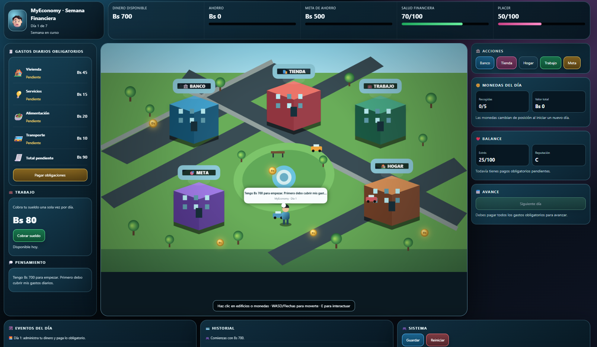
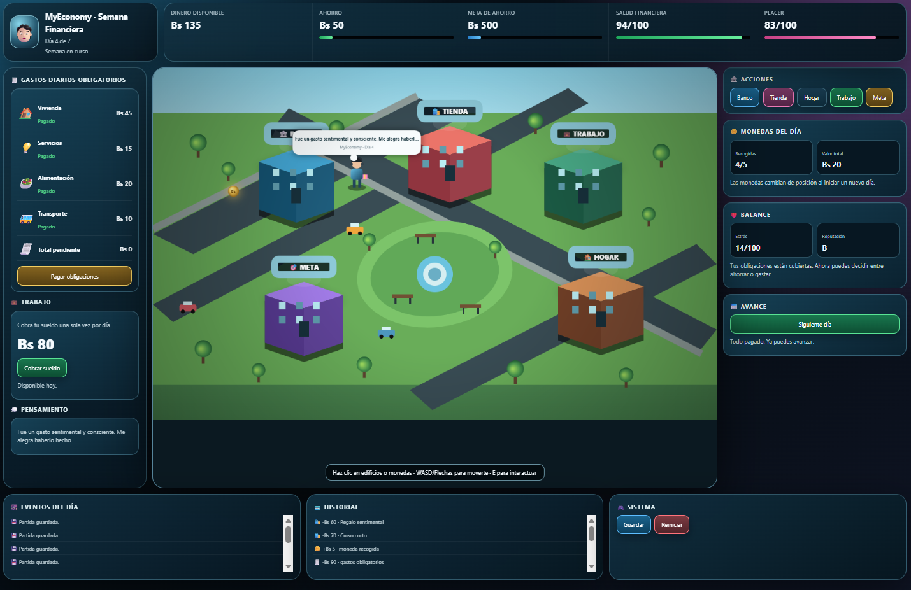
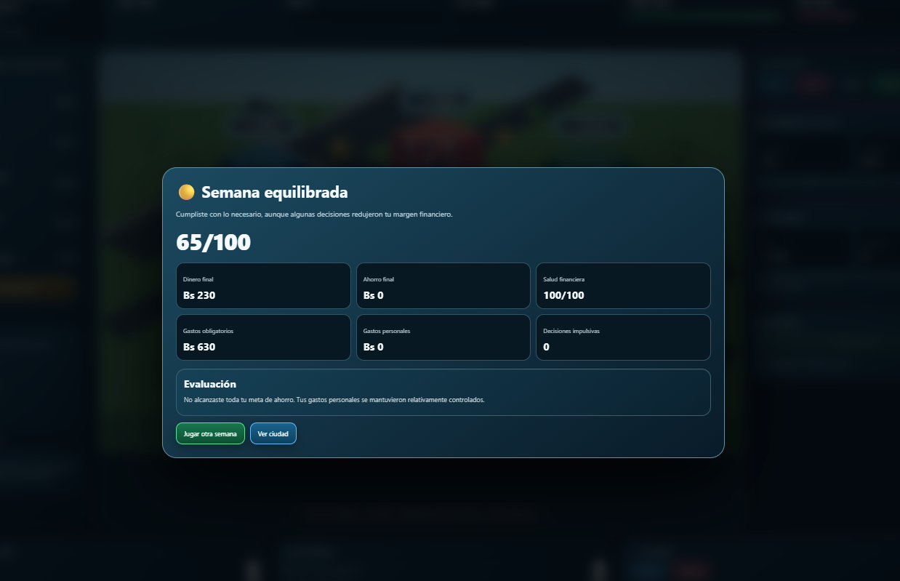

<p align="center">
  <sub>LEVEL 06 · GDD</sub>
</p>

<h1 align="center">💰 MyEconomy</h1>

<p align="center">
  <code>SIMULACIÓN</code>
  &nbsp; ✦ &nbsp;
  <code>ESTRATEGIA</code>
  &nbsp; ✦ &nbsp;
  <code>FINANZAS</code>
</p>

<p align="center">
  <i>Cada decisión de hoy modifica lo que tendrás mañana.</i>
</p>

<br>

<p align="center">
  
</p>

<p align="center">
  <sub>✦ LEVEL 06 ✦</sub>
</p>

<br>

---

<h2 align="center">💰 SOBRE EL JUEGO</h2>

<p align="center">
  <sub>Administrar no significa solamente gastar menos: significa decidir mejor.</sub>
</p>

**MyEconomy** es un videojuego educativo de simulación y estrategia casual enfocado en la administración responsable del dinero.

El jugador controla a un joven durante una **semana financiera de 7 días** en la que debe administrar sus recursos mientras cubre gastos obligatorios, obtiene ingresos, recoge monedas, utiliza el banco y decide cuándo ahorrar o gastar.

Cada decisión modifica su situación económica y puede afectar indicadores como la salud financiera, el placer, el estrés y la reputación.

<p align="center">
  🌐 <b>HTML · CSS · JavaScript</b>
  &nbsp;&nbsp; ✦ &nbsp;&nbsp;
  📅 <b>7 días</b>
  &nbsp;&nbsp; ✦ &nbsp;&nbsp;
  🎯 <b>Meta de ahorro</b>
</p>

<br>

---

<h2 align="center">🎯 OBJETIVO</h2>

<p align="center">
  Completar la semana administrando correctamente los recursos y conservando una situación financiera saludable.
</p>

El jugador debe cubrir primero sus necesidades obligatorias y después decidir cómo utilizar el dinero restante.

Durante la partida puede:

- generar ingresos;
- recoger dinero;
- ahorrar;
- utilizar el banco;
- realizar compras;
- controlar gastos;
- intentar alcanzar su meta de ahorro.

Al finalizar el séptimo día, MyEconomy evalúa las decisiones tomadas y genera un resultado financiero final.

<br>

---

<h2 align="center">🧩 MECÁNICA PRINCIPAL</h2>

<p align="center">
  <kbd>OBTENER</kbd>
  &nbsp; → &nbsp;
  <kbd>PRIORIZAR</kbd>
  &nbsp; → &nbsp;
  <kbd>DECIDIR</kbd>
  &nbsp; → &nbsp;
  <kbd>ADMINISTRAR</kbd>
  &nbsp; → &nbsp;
  <kbd>EVALUAR</kbd>
</p>

<br>

La mecánica principal consiste en **administrar recursos mediante decisiones financieras**.

El jugador obtiene dinero durante la semana y debe decidir cómo distribuirlo entre:

<p align="center">
  <code>NECESIDADES</code>
  &nbsp; ✦ &nbsp;
  <code>AHORRO</code>
  &nbsp; ✦ &nbsp;
  <code>DESEOS</code>
</p>

No todas las compras tienen el mismo efecto.

Algunas representan decisiones útiles o conscientes, mientras que otras son gastos impulsivos que pueden aumentar el placer inmediato pero reducir el margen financiero disponible para los siguientes días.

---

## CONTROLES

| Control | Acción |
|---|---|
| `W` / `↑` | Mover hacia arriba |
| `A` / `←` | Mover hacia la izquierda |
| `S` / `↓` | Mover hacia abajo |
| `D` / `→` | Mover hacia la derecha |
| `E` | Interactuar con un edificio cercano |
| `CLICK` · Edificio | Abrir directamente una ubicación |
| `CLICK` · Moneda | Recoger una moneda |
| `CLICK` · Botones | Utilizar las diferentes acciones de la interfaz |

La mayoría de las operaciones financieras también pueden realizarse directamente desde los botones visibles en pantalla.

---

## CÓMO FUNCIONA

`01` El jugador comienza la semana con dinero disponible.  
`02` Cada día aparecen gastos obligatorios que deben cubrirse.  
`03` Puede cobrar el salario correspondiente al día.  
`04` También puede desplazarse por la ciudad y recoger monedas.  
`05` El banco permite depositar o retirar dinero.  
`06` La tienda presenta diferentes opciones de compra.  
`07` Las decisiones modifican los indicadores financieros y personales.  
`08` Solo es posible avanzar al siguiente día después de pagar las obligaciones.  
`09` El proceso continúa durante los siete días.  
`10` Al finalizar la semana se calcula una evaluación financiera sobre 100.

---

## PROGRESIÓN

La progresión de MyEconomy se representa mediante el paso de los **7 días de una semana**.

<p align="center">
  <kbd>DÍA 01</kbd>
  &nbsp; → &nbsp;
  <kbd>DÍA 02</kbd>
  &nbsp; → &nbsp;
  <kbd>...</kbd>
  &nbsp; → &nbsp;
  <kbd>DÍA 07</kbd>
  &nbsp; → &nbsp;
  <kbd>RESULTADO</kbd>
</p>

<br>

Cada nuevo día obliga al jugador a volver a organizar sus recursos.

Debe equilibrar:

- obligaciones;
- ingresos;
- dinero disponible;
- ahorro acumulado;
- gastos personales;
- salud financiera;
- placer;
- estrés.

El desafío no consiste únicamente en sobrevivir un día, sino en pensar cómo las decisiones actuales pueden afectar **el resto de la semana**.

<details>
<summary><b>✦ Ver ciclo financiero diario</b></summary>

<br>

**1 · Revisar**

Observar el dinero disponible, los gastos pendientes y el estado general.

---

**2 · Generar ingresos**

Cobrar el salario diario y recoger las monedas distribuidas en la ciudad.

---

**3 · Cubrir necesidades**

Pagar las obligaciones correspondientes a vivienda, servicios, alimentación y transporte.

---

**4 · Decidir**

Elegir cuánto dinero conservar, ahorrar o utilizar en otras compras.

---

**5 · Evaluar**

Revisar el estado financiero antes de finalizar el día.

---

**6 · Avanzar**

Después de cubrir todas las obligaciones se habilita el siguiente día.

</details>

<br>

---

<h2 align="center">🏙️ CIUDAD FINANCIERA</h2>

<p align="center">
  <sub>Cada espacio representa una decisión diferente sobre los recursos.</sub>
</p>

La ciudad funciona como la interfaz principal de MyEconomy.

<p align="center">
  <kbd>🏦 BANCO</kbd>
  &nbsp; ✦ &nbsp;
  <kbd>🛍️ TIENDA</kbd>
  &nbsp; ✦ &nbsp;
  <kbd>💼 TRABAJO</kbd>
  &nbsp; ✦ &nbsp;
  <kbd>🏠 HOGAR</kbd>
  &nbsp; ✦ &nbsp;
  <kbd>🎯 META</kbd>
</p>

<br>

**🏦 Banco**  
Permite depositar parte del dinero disponible o retirar los ahorros cuando sea necesario.

**🛍️ Tienda**  
Presenta compras con diferentes efectos sobre la economía y bienestar del personaje.

**💼 Trabajo**  
Permite cobrar el ingreso correspondiente al día.

**🏠 Hogar**  
Muestra un resumen del estado actual del jugador.

**🎯 Meta**  
Permite comprobar cuánto se ha avanzado hacia el objetivo de ahorro semanal.

---

<h2 align="center">⚖️ DECISIONES FINANCIERAS</h2>

<p align="center">
  <sub>No todo gasto es malo y no toda decisión produce el mismo resultado.</sub>
</p>

MyEconomy busca diferenciar entre **necesidades, decisiones conscientes y gastos impulsivos**.

Las elecciones pueden afectar diferentes variables:

**💵 Dinero disponible**  
Recursos que pueden utilizarse inmediatamente.

**🏦 Ahorro**  
Dinero reservado para cumplir la meta financiera o afrontar necesidades futuras.

**❤️ Salud financiera**  
Representa la estabilidad conseguida mediante las decisiones tomadas.

**🎉 Placer**  
Refleja la satisfacción obtenida mediante ciertas compras y actividades.

**😰 Estrés**  
Puede cambiar según el estado de las obligaciones y las decisiones realizadas.

**⭐ Reputación**  
Representa la calidad general de determinadas elecciones financieras.

El objetivo no es eliminar completamente los gastos personales, sino aprender a mantener un **equilibrio entre obligaciones, ahorro y disfrute**.

---

<h2 align="center">🏆 RESULTADO FINANCIERO</h2>

<p align="center">
  <sub>La partida termina con una evaluación de toda la semana.</sub>
</p>

Al completar el séptimo día, el juego genera una puntuación final sobre **100 puntos** considerando principalmente:

<p align="center">
  <code>AHORRO</code>
  &nbsp; ✦ &nbsp;
  <code>SALUD FINANCIERA</code>
  &nbsp; ✦ &nbsp;
  <code>RESPONSABILIDAD</code>
</p>

El resultado puede ubicarse en diferentes niveles:

`🏆 Semana excelente`  
`🟢 Semana responsable`  
`🟡 Semana equilibrada`  
`🟠 Semana complicada`  
`🔴 Semana de riesgo`

La evaluación también muestra información como dinero final, ahorro, gastos obligatorios, gastos personales y decisiones impulsivas.

---

<h2 align="center">🎨 GALERÍA</h2>

<p align="center">
  <sub>Una semana de ingresos, gastos, ahorro y decisiones.</sub>
</p>

<br>

<p align="center">
  
</p>

<p align="center">
  <sub>💰 GAMEPLAY</sub>
</p>

<br>

<p align="center">
  
</p>

<p align="center">
  <sub>🏆 RESULTADO FINANCIERO</sub>
</p>

<br>

---

## DESARROLLO

<p align="center">
  <code>HTML</code>
  &nbsp; ✦ &nbsp;
  <code>CSS</code>
  &nbsp; ✦ &nbsp;
  <code>JavaScript</code>
</p>

**HTML**  
Estructura del HUD, paneles, botones, modales y elementos de interacción.

**CSS**  
Diseño visual de la interfaz, ciudad, tarjetas, indicadores y ventanas del juego.

**JavaScript**  
Movimiento, economía, ingresos, gastos, banco, ahorro, compras, progresión diaria, persistencia y evaluación final.

El prototipo se encuentra integrado en un único archivo:

```text
index.html
```

---

<h2 align="center">📘 DISEÑO MEDIANTE GDD</h2>

<p align="center">
  <sub>Diseñar primero para programar con una dirección clara.</sub>
</p>

Antes de producir MyEconomy se desarrolló un **Game Design Document (GDD)**.

El documento permitió definir de manera organizada:

<p align="center">
  <code>concepto</code>
  &nbsp; ✦ &nbsp;
  <code>género</code>
  &nbsp; ✦ &nbsp;
  <code>objetivo</code>
  &nbsp; ✦ &nbsp;
  <code>mecánica</code>
  &nbsp; ✦ &nbsp;
  <code>reglas</code>
</p>

<p align="center">
  <code>progresión</code>
  &nbsp; ✦ &nbsp;
  <code>personajes</code>
  &nbsp; ✦ &nbsp;
  <code>arte</code>
  &nbsp; ✦ &nbsp;
  <code>público</code>
  &nbsp; ✦ &nbsp;
  <code>victoria / derrota</code>
</p>

El GDD funcionó como referencia para que el prototipo mantuviera coherencia entre la idea inicial y el resultado jugable.

<details>
<summary><b>📘 Ver síntesis del GDD</b></summary>

<br>

**Concepto**  
Administrar dinero durante diferentes situaciones cotidianas y experimentar las consecuencias de cada decisión.

**Género**  
Simulación y estrategia casual con elementos de aventura y toma de decisiones.

**Público objetivo**  
Jóvenes de 18 a 25 años que comienzan a administrar sus propios ingresos y gastos.

**Mecánica principal**  
Obtener dinero y decidir entre gastar, ahorrar o utilizar servicios bancarios.

**Reglas**  
Los ingresos aumentan los recursos disponibles, los gastos los reducen y las obligaciones deben cubrirse para poder continuar.

**Progresión**  
Las decisiones financieras se acumulan durante el recorrido y modifican la situación económica final.

**Objetivo**  
Terminar el recorrido manteniendo estabilidad financiera y, preferiblemente, una cantidad de dinero ahorrada.

</details>

<br>

---

<h2 align="center">🤖 PROCESO CON IA</h2>

<p align="center">
  <sub>Del documento de diseño al prototipo funcional.</sub>
</p>

<p align="center">
  <kbd>GDD</kbd>
  &nbsp; → &nbsp;
  <kbd>REFERENCIA VISUAL</kbd>
  &nbsp; → &nbsp;
  <kbd>PROMPT</kbd>
  &nbsp; → &nbsp;
  <kbd>PROTOTIPO</kbd>
  &nbsp; → &nbsp;
  <kbd>VALIDACIÓN</kbd>
</p>

<br>

La Inteligencia Artificial generativa se utilizó como herramienta de apoyo durante la producción del prototipo.

En esta práctica, el prompt debía construirse utilizando directamente la información definida previamente en el GDD:

- concepto;
- mecánica principal;
- reglas;
- progresión;
- condiciones de victoria y derrota;
- referencia visual.

El objetivo no era generar un juego independiente de la planificación, sino construir un prototipo que **representara lo que el documento había definido**.

Posteriormente, otros equipos compararon el GDD, la referencia visual y el prototipo para comprobar su coherencia.


---

<h2 align="center">🔁 LO QUE APRENDÍ</h2>

<p align="center">
  <i>Documentar una idea también forma parte de diseñar un videojuego.</i>
</p>

MyEconomy me permitió comprender la importancia de definir un videojuego antes de comenzar su producción.

El **GDD funciona como una fuente común de decisiones** que permite mantener alineados el concepto, las mecánicas, las reglas, el aspecto visual y el resultado final.

<p align="center">
  <kbd>IDEA</kbd>
  &nbsp; → &nbsp;
  <kbd>GDD</kbd>
  &nbsp; → &nbsp;
  <kbd>PRODUCCIÓN</kbd>
  &nbsp; → &nbsp;
  <kbd>VALIDACIÓN</kbd>
</p>

<br>

Durante la práctica trabajé principalmente en:

<p align="center">
  <code>GDD</code>
  &nbsp; ✦ &nbsp;
  <code>planificación</code>
  &nbsp; ✦ &nbsp;
  <code>gestión de recursos</code>
  &nbsp; ✦ &nbsp;
  <code>reglas</code>
  &nbsp; ✦ &nbsp;
  <code>progresión</code>
  &nbsp; ✦ &nbsp;
  <code>validación</code>
</p>

También aprendí que documentar previamente ayuda a comprobar después si el prototipo realmente representa **la experiencia que se había diseñado**.

<br>

---

<h2 align="center">🚀 SIGUIENTE NIVEL</h2>

<p align="center">
  <sub>Ideas para llevar la simulación financiera más lejos.</sub>
</p>

En una próxima versión me gustaría explorar:

- eventos financieros inesperados;
- más opciones de ingresos;
- diferentes tipos de empleo;
- inversiones y rendimientos;
- préstamos y créditos;
- diferentes metas de ahorro;
- más decisiones de compra;
- varias semanas o campañas;
- estadísticas históricas;
- distintos perfiles financieros finales.

<br>

---

## EJECUCIÓN

MyEconomy puede jugarse directamente desde el navegador sin instalar software adicional.

<br>

<p align="center">
  <a href="https://melaniquintelaaguilar.github.io/game-development-portfolio/juegos/06-myeconomy/">
    <b>💰 JUGAR MYECONOMY</b>
  </a>
</p>

<p align="center">
  <sub>Disponible mediante GitHub Pages</sub>
</p>

<br>

---

<p align="center">
  <sub>✦ ✦ ✦</sub>
</p>

<p align="center">
  <b>💰 LEVEL 06 COMPLETE</b>
</p>

<p align="center">
  <sub>Game Design Document desbloqueado</sub>
</p>

<br>

<p align="center">
  <a href="../../README.md">← VOLVER AL PORTAFOLIO</a>
</p>